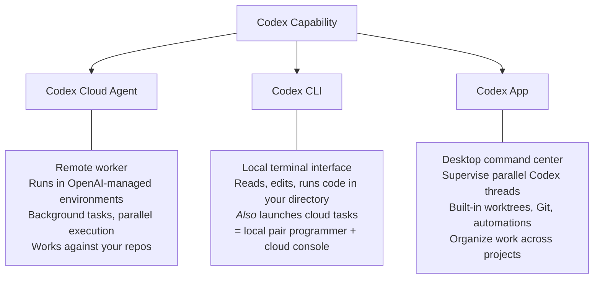
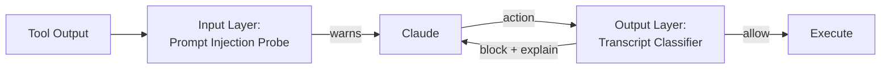
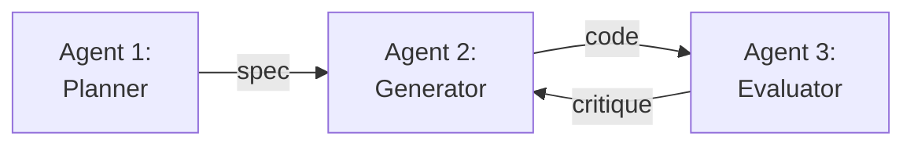
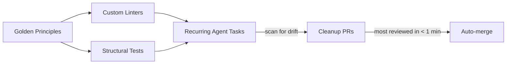
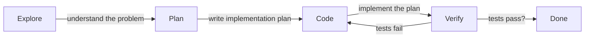
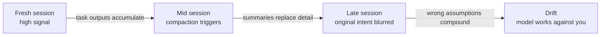

# AI-Assisted Software Development

Harnesses, Frontier Models, and What's Possible

  
Bill Katz

  
Scientific Computing Software

  
HHMI Janelia Research Campus

---

# Companion Resource Page

This talk has a companion repo: **`janelia-scicomp/ai-assisted-dev`**

It's in early development — mostly seeded with sources from this talk. The goal is a curated, searchable collection of links for AI-assisted development at Janelia.

**If time permits** — some wild ideas for where this could go:

- Rate and comment on resources (short Janelian reviews, not essays)
- Tag-based search across tools, approaches, and examples
- "Follow" individual Janelians to see what they find useful
- AI-powered search that understands what you're actually looking for

For now: explore the links, and contribute anything you've found helpful.

---

# Talk Roadmap

1. **The Ecosystem** — Frontier models, harnesses, and what's available at Janelia
2. **Approaches** — Common patterns for AI-assisted development
3. **Issues** — Context rot, model degradation, and the feedback loop
4. **Extraordinary Examples** — What people are actually building

---
layout: section
---

# Part I: The Ecosystem

Frontier Models & Harnesses

---

# Three Frontier Systems

| | **Claude** (Anthropic) | **GPT / Codex** (OpenAI) | **Gemini** (Google) |
|---|---|---|---|
| Model | Opus 4.6, Sonnet 4.6 | GPT-5.4 | 3.1 Pro, Flash |
| Context | 200K-1M tokens | 200K-1M | 1M tokens |
| Harness | **Claude Code & App**, **Cowork** | **Codex**, **ChatGPT** | **Gemini CLI**, **Antigravity** |

All support tool use, MCP, and agentic workflows.

Introduced: Claude Code (Feb 2025), OpenAI Codex (May 2025), Gemini CLI (June 2025)

---

# What is a Harness?

The **model** is the horse — raw power and capability.

The **harness** is the equipment that lets you direct the horse, keep the rider comfortable, and make the trip productive.

Saddle, reins, stirrups → context management, tool use, feedback loops

---

# Harnesses: The Orchestration Layer

A **harness** wraps a frontier model with everything it needs to do useful work:

<svg viewBox="0 0 700 200" xmlns="http://www.w3.org/2000/svg" class="w-full mt-2">
  <defs>
    <marker id="ah2" markerWidth="8" markerHeight="6" refX="8" refY="3" orient="auto">
      <polygon points="0 0, 8 3, 0 6" fill="#666"/>
    </marker>
    <marker id="ah2rev" markerWidth="8" markerHeight="6" refX="0" refY="3" orient="auto">
      <polygon points="8 0, 0 3, 8 6" fill="#666"/>
    </marker>
  </defs>

  <!-- Developer -->
  <rect x="10" y="80" width="90" height="36" rx="6" fill="#dbeafe" stroke="#999" stroke-width="1.5"/>
  <text x="55" y="100" font-family="sans-serif" font-size="12px" font-weight="bold" text-anchor="middle">Developer</text>

  <!-- Arrow: Developer → Harness -->
  <line x1="100" y1="98" x2="148" y2="98" fill="none" stroke="#666" stroke-width="1.5" marker-end="url(#ah2)"/>

  <!-- Harness (center) -->
  <rect x="150" y="70" width="100" height="56" rx="6" fill="#e0e7ff" stroke="#6366f1" stroke-width="2"/>
  <text x="200" y="94" font-family="sans-serif" font-size="12px" font-weight="bold" text-anchor="middle">Harness</text>
  <text x="200" y="110" font-family="sans-serif" font-size="9px" fill="#555" text-anchor="middle">orchestration</text>

  <!-- Arrow: Harness → Tools -->
  <line x1="250" y1="82" x2="318" y2="35" fill="none" stroke="#666" stroke-width="1.5" marker-end="url(#ah2)"/>
  <!-- Tools -->
  <rect x="320" y="12" width="170" height="36" rx="6" fill="#f3f4f6" stroke="#999" stroke-width="1.5"/>
  <text x="405" y="33" font-family="sans-serif" font-size="11px" text-anchor="middle">Tools: files, shell, search</text>

  <!-- Arrow: Harness → Context -->
  <line x1="250" y1="98" x2="318" y2="98" fill="none" stroke="#666" stroke-width="1.5" marker-end="url(#ah2)"/>
  <!-- Context -->
  <rect x="320" y="80" width="170" height="36" rx="6" fill="#f3f4f6" stroke="#999" stroke-width="1.5"/>
  <text x="405" y="101" font-family="sans-serif" font-size="11px" text-anchor="middle">Context: files, docs, history</text>

  <!-- Bidirectional arrow: Harness ↔ Frontier Model -->
  <line x1="252" y1="114" x2="318" y2="165" fill="none" stroke="#666" stroke-width="1.5" marker-start="url(#ah2rev)" marker-end="url(#ah2)"/>
  <!-- Frontier Model -->
  <rect x="320" y="148" width="170" height="36" rx="6" fill="#dbeafe" stroke="#999" stroke-width="1.5"/>
  <text x="405" y="169" font-family="sans-serif" font-size="12px" font-weight="bold" text-anchor="middle">Frontier Model</text>

  <!-- Arrow: Harness → Output -->
  <line x1="200" y1="126" x2="200" y2="155" fill="none" stroke="#666" stroke-width="1.5" marker-end="url(#ah2)"/>
  <!-- Output -->
  <rect x="150" y="158" width="100" height="32" rx="6" fill="#dcfce7" stroke="#999" stroke-width="1.5"/>
  <text x="200" y="177" font-family="sans-serif" font-size="11px" text-anchor="middle">Output</text>

  <!-- Arrow: Output → feedback loop back to Harness -->
  <path d="M 148,174 C 115,174 115,120 150,100" fill="none" stroke="#666" stroke-width="1.5" marker-end="url(#ah2)"/>
  <text x="100" y="142" font-family="sans-serif" font-size="9px" fill="#666" text-anchor="middle">verify &amp;</text>
  <text x="100" y="154" font-family="sans-serif" font-size="9px" fill="#666" text-anchor="middle">feedback</text>
</svg>

**Tools** — file editing, shell commands, web search, MCP integrations 
**Context** — what the model sees, when, and how much 
**Feedback loops** — verification, test results, human review fed back in

---

# Harness UX: Different Surfaces for Different Workflows

| UX Surface | What it's for | Claude | OpenAI | Google |
|---|---|---|---|---|
| **IDE** | Code in a familiar editor with AI inline | — | Copilot | Gemini Code Assist |
| **CLI** | Interactive terminal sessions, agentic coding | Claude Code | Codex CLI | Gemini CLI |
| **Desktop App** | Project sidebar, parallel sessions, diff review | Claude App | Codex App | — |
| **Cloud Agent** | Async background tasks on your repos | — | Codex Cloud | — |
| **Chat / Web** | Conversation-first, paste code in and out | claude.ai | ChatGPT | Gemini |

Each vendor is converging on multiple surfaces — but the sweet spots differ.

---

# OpenAI Codex: Different Harnesses → Different UIs

  
  
ChatGPT App

  
  
Codex CLI

  
  
Codex App

---

# OpenAI Codex: Three Control Surfaces

One capability, three interfaces:

<a href="https://developers.openai.com/codex">developers.openai.com/codex</a>

---

# Claude: Comparison of Two Surfaces

<!-- TODO: Add screenshot(s) showing Claude Code CLI and/or Cowork desktop -->

<svg viewBox="0 0 360 220" xmlns="http://www.w3.org/2000/svg" class="w-full">
  
  <!-- Claude Code layer (inner) -->
  <rect x="60" y="70" width="240" height="100" rx="12" fill="#dbeafe" stroke="#3b82f6" stroke-width="2"/>
  <text x="180" y="105" class="layer-label" font-weight="bold" fill="#1e40af">Claude Code</text>
  <text x="180" y="125" class="detail">CLI · Bash/Read/Write/Edit · CLAUDE.md</text>
  <text x="180" y="140" class="detail">Manual context · 1M tokens · Full control</text>

  <!-- Cowork layer (outer) -->
  <rect x="15" y="20" width="330" height="190" rx="16" fill="none" stroke="#8b5cf6" stroke-width="2.5" stroke-dasharray="6,3"/>
  <text x="180" y="45" class="layer-label" font-weight="bold" fill="#6d28d9">Cowork</text>
  <text x="180" y="195" class="detail" fill="#6d28d9">VM sandbox · Auto-context · Sub-agents · MCP connectors · Plugins</text>
</svg>

**Cowork wraps Claude Code** with additional infrastructure for non-developers:

- Full **VM isolation** (Apple Virtualization Framework)
- **Automatic** context management — no `/compact` or `/clear`
- **Parallel sub-agents** for complex tasks
- **Three-tier permissions** (none → folder-scoped → explicit approval)
- MCP connectors, plugins, MCP Apps

Built with Claude Code in ~1.5 weeks — humans designed the architecture, agents wrote the code.

---

# Claude: Comparison of Two Surfaces

| | **Claude Code** (CLI) | **Cowork** (Desktop App) |
|---|---|---|
| Context window | Up to 1M tokens (GA, March 2026) | Managed automatically |
| Auto-compaction | Triggers at ~83.5% full — summarizes and continues | Handled behind the scenes |
| Manual control | `/compact` to summarize, `/clear` to reset | Not needed |
| Customization | CLAUDE.md can specify what to preserve during compaction | — |

**Why this matters:** Long coding sessions accumulate tool outputs, file contents, and conversation history. Without compaction, the model loses access to its earliest context — including your original intent.

The 1M token window reduced compaction events by 15%, but context management remains a core harness engineering problem.

---

# Claude Code Auto Mode: Safety vs. Usability

Users approve **93%** of permission prompts — approval fatigue is real.

**Sandboxing** — high security, high maintenance

**Manual prompts** — users stop reading

**Auto mode** — classifiers automate safe decisions, flag dangerous ones

*Released March 24, 2026 — Team plan (research preview). Enterprise & API rolling out.*

<a href="https://www.anthropic.com/engineering/claude-code-auto-mode">anthropic.com/engineering/claude-code-auto-mode</a>

---

# Harness Engineering: Claude Code Auto Mode

A two-layer classifier system instead of "approve everything" or "block everything":

**What it catches:** scope escalation, credential exploration, unauthorized data sharing, security bypass attempts

**What it misses (17% false-negative rate):** ambiguous "blast radius" — e.g., does "clean up the PR" authorize a force-push?

Design choice: strip assistant messages from classifier input so the agent can't talk the classifier into approving dangerous actions.

<a href="https://www.anthropic.com/engineering/claude-code-auto-mode">anthropic.com/engineering/claude-code-auto-mode</a>

---

# Harness Design: Multi-Agent Patterns

Anthropic's Prithvi Rajasekaran on building long-running coding agents:

A single agent evaluating its own work is too optimistic. Solution: **three separate agents**, inspired by GANs:

- One agent alone ($9, 20 min) → broken, unusable code
- Three-agent harness ($200, 6 hrs) → fully working applications
- Models exhibit "context anxiety" — wrapping up early as context fills
- Context *resets* work better than context *compaction* for long tasks

*"Find the simplest solution possible, and only increase complexity when needed."*

<a href="https://www.anthropic.com/engineering/harness-design-long-running-apps">anthropic.com/engineering/harness-design-long-running-apps</a>

---

# Two Philosophies of Harness Design

| | **Claude Code** (Anthropic) | **Codex** (OpenAI) |
|---|---|---|
| Core idea | "Bash is all you need" | "The repo is the knowledge store" |
| Tools | Minimal: Bash, Read, Write, Edit, Glob, Grep | Sandboxed envs, linters, execution plans, observability |
| Context source | File system — model navigates with basic tools | Repository — if it's not checked in, it doesn't exist |
| Harness role | Thin wrapper; trust the model | Rigid architecture with enforced boundaries + automated cleanup |
| Demand on dev | Write good code; model figures it out | Push all knowledge into repo: docs, plans, decisions, specs |
| Key file | `CLAUDE.md` — project instructions | `AGENTS.md` as table of contents → structured `docs/` tree |

Both work. Different bets on where the intelligence lives.

<a href="https://openai.com/index/harness-engineering/">openai.com/index/harness-engineering</a>

---

# "Garbage Collection" for Technical Debt

OpenAI's team spent 20% of their week manually cleaning up "AI slop." That didn't scale.

Their solution: **encode taste as rules, then automate enforcement.**

- Enforce architecture mechanically: dependency directions, naming conventions, file size limits
- Linter error messages written as remediation instructions for agents
- Technical debt paid continuously in small increments, not painful bursts
- Human taste captured once, enforced on every line of code going forward

<a href="https://openai.com/index/harness-engineering/">openai.com/index/harness-engineering</a>

---

# The Harness Layer Is Evolving Fast

Harnesses are getting smarter about what the model sees and how it acts.

Example: Anthropic's "Advanced Tool Use" (beta, March 2026)

| Problem | Solution | Impact |
|---|---|---|
| Too many tools loaded upfront | **Tool Search** — find tools on-demand | 85% fewer tokens |
| Too many round-trips to the model | **Programmatic Calling** — orchestrate in code | 37% fewer tokens |
| Schema alone isn't enough | **Tool Use Examples** — show, don't just describe | 72% → 90% accuracy |

<a href="https://www.anthropic.com/engineering/advanced-tool-use">anthropic.com/engineering/advanced-tool-use</a>

---

# What's Available at Janelia

**OpenAI (HHMI Enterprise)**
- Organization-wide token pool for HQ+Janelia
- ChatGPT, Codex cloud agent, Codex CLI
- It's a big pool. HQ more ChatGPT-oriented.

**Anthropic (Claude)**
- Enterprise collaboration in progress
- Currently: Claude Max plans or API access
- Soon: Enterprise individualized "consumption" model (not Max)

**Google (Gemini)**
- Limited Enterprise licenses (~$20/mo Pro) available through Support
- Licensing more fractured. Unsure about Ultra and above.
- Gemini CLI is free with personal Google accounts (1K requests/day)

Disclaimer: As of Apr 2, 2026

---
layout: section
---

# Part II: Common Approaches

Patterns for AI-Assisted Development

---

# Claude Best Practices: Explore → Plan → Code → Verify

The single highest-leverage pattern across all harnesses:

**Explore** — Read code, ask questions, understand the system. Use Plan Mode or Ask Mode.

**Plan** — Create an implementation plan *before* writing code. Edit the plan yourself if needed.

**Code** — Let the agent implement against the plan. Reference specific files and patterns.

**Verify** — Give the agent a way to check its own work: tests, screenshots, linters, build commands. This is the single highest-leverage thing you can do.

*Skip the plan for small, obvious tasks. Use it when scope is unclear or changes span multiple files.*

<a href="https://code.claude.com/docs/en/best-practices">code.claude.com/docs/en/best-practices</a>

---

# Common Failure Patterns (and Fixes)

Recognizing these early saves hours:

**The kitchen sink session** — One task, then something unrelated, then back to the first. Context fills with noise.
→ `/clear` between unrelated tasks.

**Correcting over and over** — Claude does it wrong, you correct, still wrong, correct again. Context polluted with failed approaches.
→ After two failed corrections, `/clear` and write a better initial prompt.

**The over-specified CLAUDE.md** — Too long, Claude ignores half of it. Important rules get lost.
→ Ruthlessly prune. If Claude already does it correctly without the rule, delete it.

**The trust-then-verify gap** — Plausible-looking code that doesn't handle edge cases.
→ Always provide verification. If you can't verify it, don't ship it.

**The infinite exploration** — "Investigate this" without scoping. Claude reads hundreds of files.
→ Scope narrowly, or delegate to a subagent so exploration doesn't consume your main context.

<a href="https://code.claude.com/docs/en/best-practices">code.claude.com/docs/en/best-practices</a>

---

# OpenAI Best Practices for AI-Assisted Coding

From OpenAI's internal engineering teams — but these generalize across harnesses:

**Start with a plan, then code** — Use "Ask mode" first to generate an implementation plan. Then switch to coding mode with that plan as input. Keeps the agent grounded.

**Structure prompts like GitHub Issues** — Include file paths, component names, diffs, and doc snippets. "Implement this the same way it's done in [module X]" improves results.

**Use the task queue as a backlog** — Fire off tangential ideas, partial work, incidental fixes. No pressure for a full PR in one go. Review when you're back in focus.

**Iterate on the environment, not the prompt** — Build errors? Fix the dev environment config, not the prompt. Startup scripts, env vars, and internet access reduce error rates significantly.

**"Best of N" for hard problems** — Generate multiple responses for a single task, review several iterations, combine the best parts.

**Keep tasks well-scoped** — Sweet spot: tasks that would take you about an hour or a few hundred lines of code.

<a href="https://cdn.openai.com/pdf/6a2631dc-783e-479b-b1a4-af0cfbd38630/how-openai-uses-codex.pdf">OpenAI: "How OpenAI uses Codex" (PDF)</a>

---

# How OpenAI Engineers Actually Use Codex

Seven use cases from OpenAI's internal teams (Security, Frontend, API, Infrastructure):

| Use Case | What they do |
|---|---|
| **Code understanding** | Paste a stack trace, ask where the auth flow lives — faster than grep |
| **Refactoring & migrations** | Swap legacy patterns across dozens of files, open the PR in minutes |
| **Performance optimization** | Flag hot paths, draft batched queries — "5 min prompt saves 30 min work" |
| **Test coverage** | Point at low-coverage modules overnight, wake up to unit-test PRs |
| **Development velocity** | Scaffold boilerplate, triage bugs, ship low-priority fixes from backlog |
| **Staying in flow** | Fire off drive-by fixes as background tasks, review PRs when free |
| **Exploration & ideation** | Explore alternative architectures, find similar bugs across codebase |

These patterns apply equally to Claude Code, Gemini CLI, and other harnesses.

<a href="https://cdn.openai.com/pdf/6a2631dc-783e-479b-b1a4-af0cfbd38630/how-openai-uses-codex.pdf">OpenAI: "How OpenAI uses Codex" (PDF)</a>

---
layout: section
---

# Part III: Issues

Context Rot, Model Degradation, and the Feedback Loop

---

# Context Rot: Death by a Thousand Tokens

As a session grows, the model's effective intelligence degrades — not because it gets dumber, but because signal gets buried in noise.

**What rots:**
- Your original intent and constraints get summarized away
- Failed approaches stay in context, biasing toward the same mistakes
- Tool outputs (file contents, test results) crowd out your instructions
- After compaction, the model works from a summary of a summary

**What helps:**
- Start fresh (`/clear`) for genuinely new tasks
- Keep sessions focused on one goal
- Front-load important constraints in CLAUDE.md (survives compaction)
- Use subagents for exploration so your main context stays clean

---

# Context Rot in Practice

A real pattern that wastes hours:

<svg viewBox="0 0 720 195" xmlns="http://www.w3.org/2000/svg" class="w-full mt-2">
  
  <defs>
    <marker id="arrowhead" markerWidth="8" markerHeight="6" refX="8" refY="3" orient="auto">
      <polygon points="0 0, 8 3, 0 6" fill="#666"/>
    </marker>
  </defs>

  <!-- Column 1: down -->
  <rect x="20" y="10" width="180" height="32" class="box" fill="#dbeafe"/>
  <text x="110" y="26" class="label" font-weight="bold">Task: "Fix login bug"</text>
  <line x1="110" y1="42" x2="110" y2="56" class="arrow"/>

  <rect x="20" y="56" width="180" height="32" class="box" fill="#f3f4f6"/>
  <text x="110" y="72" class="label">Agent reads 12 files</text>
  <line x1="110" y1="88" x2="110" y2="102" class="arrow"/>

  <rect x="20" y="102" width="180" height="32" class="box" fill="#fee2e2"/>
  <text x="110" y="118" class="label">Fix #1 — wrong approach</text>
  <line x1="110" y1="134" x2="110" y2="148" class="arrow"/>

  <rect x="20" y="148" width="180" height="32" class="box" fill="#fef9c3"/>
  <text x="110" y="164" class="label">You: "No, try X instead"</text>

  <!-- Arrow right from col 1 to col 2 -->
  <line x1="200" y1="164" x2="270" y2="164" class="arrow"/>

  <!-- Column 2: up -->
  <rect x="270" y="148" width="180" height="32" class="box" fill="#f3f4f6"/>
  <text x="360" y="164" class="label">Agent reads 8 more files</text>
  <line x1="360" y1="148" x2="360" y2="134" class="arrow"/>

  <rect x="270" y="102" width="180" height="32" class="box" fill="#fee2e2"/>
  <text x="360" y="118" class="label">Fix #2 — closer but off</text>
  <line x1="360" y1="102" x2="360" y2="88" class="arrow"/>

  <rect x="270" y="56" width="180" height="32" class="box" fill="#fef9c3"/>
  <text x="360" y="72" class="label">You: "Issue is in auth.ts"</text>

  <!-- Arrow right from col 2 to col 3 -->
  <line x1="450" y1="72" x2="520" y2="72" class="arrow"/>

  <!-- Column 3: down -->
  <rect x="520" y="56" width="180" height="32" class="warn-box" fill="#ffedd5"/>
  <text x="610" y="72" class="label" font-weight="bold">Compaction triggers</text>
  <line x1="610" y1="88" x2="610" y2="102" class="arrow"/>

  <rect x="520" y="102" width="180" height="32" class="fail-box" fill="#fecaca"/>
  <text x="610" y="118" class="label" font-weight="bold">Fix #3 — repeats #1</text>
</svg>

Context is now ~80% failed attempts. The model is optimizing against polluted history.

**The fix:** After two failed corrections, `/clear` and write a single, precise prompt incorporating what you've learned. Five minutes of prompt writing beats thirty minutes of correction loops.

---

# Model Degradation: Why Does It Feel Dumber Sometimes?

The model is a black box. When quality seems to drop, the cause is rarely what you think.

**It's probably not the model:**
- **Context pollution** — noise accumulated over a long session drowns out your intent
- **Prompt ambiguity** — your request is clear to you but underspecified for the model
- **Compaction artifacts** — after auto-compaction, the model lost critical details
- **Task complexity creep** — what started small became multi-file, multi-concern

**It might be the model:**
- **Model version changes** — providers update models without notice; behavior shifts
- **Capacity-dependent routing** — some providers route to smaller models under load
- **Regression in specific domains** — a new model version may improve overall but regress on your particular use case

**It's almost never:**
- "They nerfed it" — conspiracy theories about intentional degradation
- "It worked yesterday" — your context yesterday was different

When in doubt: start a fresh session and test with a clean prompt.

---

# The Feedback Loop: Anthropic Is Listening

Anthropic tracks user satisfaction signals from conversations — including frustration.

When you curse at Claude, that interaction is flagged as a **negative satisfaction signal**. Claude doesn't change its behavior in response to cursing, but the data feeds back into model evaluation and training priorities.

What Anthropic captures:
- Thumbs up/down on responses
- Conversation-level sentiment (including profanity as frustration signal)
- Retry and regeneration patterns
- Session abandonment timing

**Why this matters for developers:**
- Your frustration literally shapes the next model version
- Specific, constructive feedback (thumbs down + explanation) is far more actionable than cursing
- The 👎 button is your most powerful tool for improving AI coding assistants

*The models are trained on what we collectively tolerate and reject.*

---
layout: section
---

# Part IV: Extraordinary Examples

What People Are Actually Building

---

# The Claude Code Leak → Agent-Driven Rewrites

A missing `.npmignore` shipped 512K lines of unobfuscated TypeScript in the npm package. What happened next:

**The leak (March 31, 2026):**
- Anthropic: "a release packaging issue caused by human error, not a security breach"
- Sigrid Jin (@realsigridjin), exhausted after running two Korean hackathons in SF, cloned the repo, went to sleep
- Woke up to massive attention — and his girlfriend (a copyright lawyer) begging him to take it down

**The pivot:**
- Team decision: "What if we have agents **rewrite the entire thing in Python**? Surely that's more legal..."
- Clean-room Python rewrite using **oh-my-codex** (OmX), an AI workflow tool built on OpenAI Codex
- Board a plane to South Korea
- Mid-flight, one team member decides Python is too slow — starts rewriting **all of it into Rust**

**The result: "claw-code"**
- **50K GitHub stars in two hours** — fastest-growing repo in GitHub history
- Anthropic filed **8,100+ DMCA takedowns**
- The knock-off now has more stars than the original Claude Code repo

---

# OpenAI's Zero-Handwritten-Code Experiment

An OpenAI team built and shipped a product with **0 lines of manually-written code**.

| Metric | Value |
|---|---|
| Hand-written code | 0 lines |
| Agent-generated code | ~1 million lines |
| PRs merged | ~1,500 |
| Engineers | 3 (later 7) |
| Throughput | 3.5 PRs / engineer / day |
| Estimated speedup | ~10x vs hand-coding |
| Duration | 5 months (from empty repo, ~Sep 2025 – Feb 2026) |

The product has internal daily users and external alpha testers. It ships, deploys, breaks, and gets fixed — all by agents.

Engineers spent 20% of time cleaning up "AI slop" → solved by automated "garbage collection" (golden principles + recurring agent cleanup tasks).

<a href="https://openai.com/index/harness-engineering/">openai.com/index/harness-engineering</a>

---
layout: center
---

# Resources & Discussion

**GitHub**: `janelia-scicomp/ai-assisted-dev`

Explore the curated resource list and contribute links.
