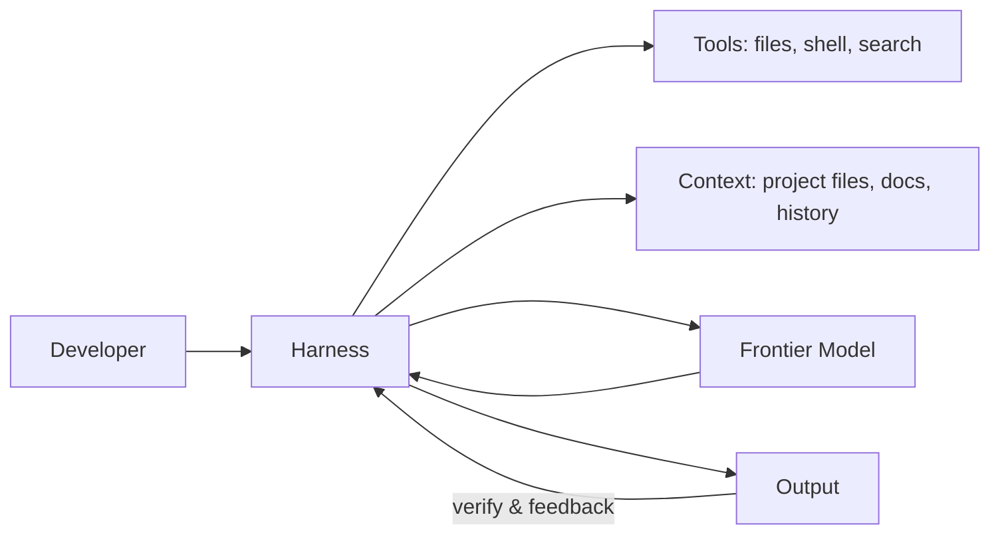
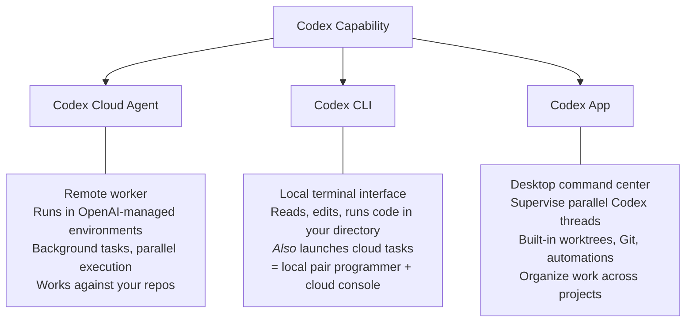
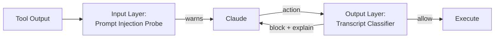
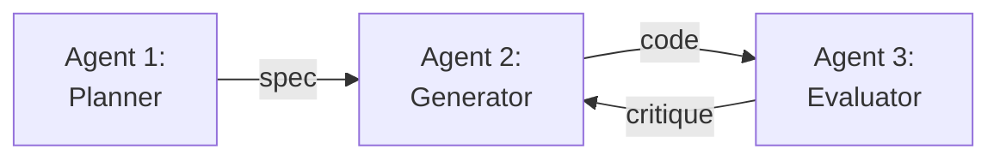
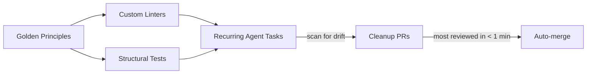

# AI-Assisted Software Development

Harnesses, Frontier Models, and What's Possible

  
    Janelia Research Campus — Scientific Software Group
  

---

# Talk Roadmap

1. **The Ecosystem** — Frontier models, harnesses, and what's available at Janelia
2. **Approaches** — Common patterns for AI-assisted development
3. **Extraordinary Examples** — What people are actually building

---
layout: section
---

# Part I: The Ecosystem

Frontier Models & Harnesses

---

# Three Frontier Systems

| | **Claude** (Anthropic) | **GPT / Codex** (OpenAI) | **Gemini** (Google) |
|---|---|---|---|
| Model | Opus 4.6, Sonnet 4.6 | GPT-5.4 | 3.1 Pro, Flash |
| Context | 200K-1M tokens | 200K-1M | 1M tokens |
| Harness | **Claude Code & App**, **Cowork** | **Codex**, **ChatGPT** | **Gemini CLI**, **Antigravity** |

All support tool use, MCP, and agentic workflows.

Introduced: Claude Code (Feb 2025), OpenAI Codex (May 2025), Gemini CLI (June 2025)

---

# What is a Harness?

The **model** is the horse — raw power and capability.

The **harness** is the equipment that lets you direct the horse, keep the rider comfortable, and make the trip productive.

Saddle, reins, stirrups → context management, tool use, feedback loops

---

# Harnesses: The Orchestration Layer

A **harness** wraps a frontier model with everything it needs to do useful work:

**Tools** — file editing, shell commands, web search, MCP integrations

**Context management** — what the model sees, when, and how much

**Feedback loops** — verification, test results, human review fed back in

---

# Harness UX: Different Surfaces for Different Workflows

| UX Surface | What it's for | Claude | OpenAI | Google |
|---|---|---|---|---|
| **IDE** | Code in a familiar editor with AI inline | — | Copilot | Gemini Code Assist |
| **CLI** | Interactive terminal sessions, agentic coding | Claude Code | Codex CLI | Gemini CLI |
| **Desktop App** | Project sidebar, parallel sessions, diff review | Claude App | Codex App | — |
| **Cloud Agent** | Async background tasks on your repos | — | Codex Cloud | — |
| **Chat / Web** | Conversation-first, paste code in and out | claude.ai | ChatGPT | Gemini |

Each vendor is converging on multiple surfaces — but the sweet spots differ.

---

# OpenAI Codex: Three Control Surfaces

One capability, three interfaces:

<a href="https://developers.openai.com/codex">developers.openai.com/codex</a>

---

# Claude Code Auto Mode: Safety vs. Usability

Users approve **93%** of permission prompts — approval fatigue is real.

**Sandboxing** — high security, high maintenance

**Manual prompts** — users stop reading

**Auto mode** — classifiers automate safe decisions, flag dangerous ones

*Released March 24, 2026 — Team plan (research preview). Enterprise & API rolling out.*

<a href="https://www.anthropic.com/engineering/claude-code-auto-mode">anthropic.com/engineering/claude-code-auto-mode</a>

---

# Harness Engineering: Claude Code Auto Mode

A two-layer classifier system instead of "approve everything" or "block everything":

**What it catches:** scope escalation, credential exploration, unauthorized data sharing, security bypass attempts

**What it misses (17% false-negative rate):** ambiguous "blast radius" — e.g., does "clean up the PR" authorize a force-push?

Design choice: strip assistant messages from classifier input so the agent can't talk the classifier into approving dangerous actions.

<a href="https://www.anthropic.com/engineering/claude-code-auto-mode">anthropic.com/engineering/claude-code-auto-mode</a>

---

# Harness Design: Multi-Agent Patterns

Anthropic's Prithvi Rajasekaran on building long-running coding agents:

A single agent evaluating its own work is too optimistic. Solution: **three separate agents**, inspired by GANs:

- One agent alone ($9, 20 min) → broken, unusable code
- Three-agent harness ($200, 6 hrs) → fully working applications
- Models exhibit "context anxiety" — wrapping up early as context fills
- Context *resets* work better than context *compaction* for long tasks

*"Find the simplest solution possible, and only increase complexity when needed."*

<a href="https://www.anthropic.com/engineering/harness-design-long-running-apps">anthropic.com/engineering/harness-design-long-running-apps</a>

---

# Two Philosophies of Harness Design

| | **Claude Code** (Anthropic) | **Codex** (OpenAI) |
|---|---|---|
| Core idea | "Bash is all you need" | "The repo is the knowledge store" |
| Tools | Minimal: Bash, Read, Write, Edit, Glob, Grep | Sandboxed envs, linters, execution plans, observability |
| Context source | File system — model navigates with basic tools | Repository — if it's not checked in, it doesn't exist |
| Harness role | Thin wrapper; trust the model | Rigid architecture with enforced boundaries + automated cleanup |
| Demand on dev | Write good code; model figures it out | Push all knowledge into repo: docs, plans, decisions, specs |
| Key file | `CLAUDE.md` — project instructions | `AGENTS.md` as table of contents → structured `docs/` tree |

Both work. Different bets on where the intelligence lives.

<a href="https://openai.com/index/harness-engineering/">openai.com/index/harness-engineering</a>

---

# "Garbage Collection" for Technical Debt

OpenAI's team spent 20% of their week manually cleaning up "AI slop." That didn't scale.

Their solution: **encode taste as rules, then automate enforcement.**

- Enforce architecture mechanically: dependency directions, naming conventions, file size limits
- Linter error messages written as remediation instructions for agents
- Technical debt paid continuously in small increments, not painful bursts
- Human taste captured once, enforced on every line of code going forward

<a href="https://openai.com/index/harness-engineering/">openai.com/index/harness-engineering</a>

---

# The Harness Layer Is Evolving Fast

Example: Anthropic's new "Advanced Tool Use" features (beta, March 2026)

The trend: harnesses are becoming smarter about what the model sees and how it acts.

| Problem | Solution | Impact |
|---|---|---|
| 5 MCP servers = 55K tokens of tool definitions before any work starts | **Tool Search Tool** — discover tools on-demand instead of loading all upfront | 85% token reduction; accuracy 49% → 74% |
| Each tool call = full inference pass; intermediate data floods context | **Programmatic Tool Calling** — Claude writes Python to orchestrate tools, only final result enters context | 37% fewer tokens; eliminates 19+ inference round-trips |
| JSON schemas can't express *when* to use optional params or ID formats | **Tool Use Examples** — concrete usage patterns alongside schemas | Accuracy 72% → 90% on complex params |

<a href="https://www.anthropic.com/engineering/advanced-tool-use">anthropic.com/engineering/advanced-tool-use</a>

---

# What's Available at Janelia

**OpenAI (HHMI Enterprise)**
- Organization-wide token allocation across HHMI
- ChatGPT, Codex cloud agent, Codex CLI

**Anthropic (Claude)**
- Enterprise collaboration in progress
- Currently: Claude Max plans or API access
- Claude Code is the primary harness most of us use

**Google (Gemini)**
- Available via Janelia (Mark K), Google-paid Google Cloud Projects
- Gemini CLI is free with personal Google accounts (1K requests/day)
- 1M token context window

---
layout: section
---

# Part II: Common Approaches

Patterns for AI-Assisted Development

---

# How OpenAI Engineers Actually Use Codex

Seven use cases from OpenAI's internal teams (Security, Frontend, API, Infrastructure):

| Use Case | What they do |
|---|---|
| **Code understanding** | Paste a stack trace, ask where the auth flow lives — faster than grep |
| **Refactoring & migrations** | Swap legacy patterns across dozens of files, open the PR in minutes |
| **Performance optimization** | Flag hot paths, draft batched queries — "5 min prompt saves 30 min work" |
| **Test coverage** | Point at low-coverage modules overnight, wake up to unit-test PRs |
| **Development velocity** | Scaffold boilerplate, triage bugs, ship low-priority fixes from backlog |
| **Staying in flow** | Fire off drive-by fixes as background tasks, review PRs when free |
| **Exploration & ideation** | Explore alternative architectures, find similar bugs across codebase |

These patterns apply equally to Claude Code, Gemini CLI, and other harnesses.

<a href="https://cdn.openai.com/pdf/6a2631dc-783e-479b-b1a4-af0cfbd38630/how-openai-uses-codex.pdf">OpenAI: "How OpenAI uses Codex" (PDF)</a>

---

# Best Practices for AI-Assisted Coding

From OpenAI's internal engineering teams — but these generalize across harnesses:

**Start with a plan, then code** — Use "Ask mode" first to generate an implementation plan. Then switch to coding mode with that plan as input. Keeps the agent grounded.

**Structure prompts like GitHub Issues** — Include file paths, component names, diffs, and doc snippets. "Implement this the same way it's done in [module X]" improves results.

**Use the task queue as a backlog** — Fire off tangential ideas, partial work, incidental fixes. No pressure for a full PR in one go. Review when you're back in focus.

**Iterate on the environment, not the prompt** — Build errors? Fix the dev environment config, not the prompt. Startup scripts, env vars, and internet access reduce error rates significantly.

**"Best of N" for hard problems** — Generate multiple responses for a single task, review several iterations, combine the best parts.

**Keep tasks well-scoped** — Sweet spot: tasks that would take you about an hour or a few hundred lines of code.

<a href="https://cdn.openai.com/pdf/6a2631dc-783e-479b-b1a4-af0cfbd38630/how-openai-uses-codex.pdf">OpenAI: "How OpenAI uses Codex" (PDF)</a>

---
layout: section
---

# Part III: Extraordinary Examples

What People Are Actually Building

---

# OpenAI's Zero-Handwritten-Code Experiment

An OpenAI team built and shipped a product with **0 lines of manually-written code**.

| Metric | Value |
|---|---|
| Hand-written code | 0 lines |
| Agent-generated code | ~1 million lines |
| PRs merged | ~1,500 |
| Engineers | 3 (later 7) |
| Throughput | 3.5 PRs / engineer / day |
| Estimated speedup | ~10x vs hand-coding |
| Duration | 5 months (from empty repo) |

The product has internal daily users and external alpha testers. It ships, deploys, breaks, and gets fixed — all by agents.

*"Humans steer. Agents execute."* — Ryan Lopopolo, OpenAI

Engineers spent 20% of time cleaning up "AI slop" → solved by automated "garbage collection" (golden principles + recurring agent cleanup tasks).

<a href="https://openai.com/index/harness-engineering/">openai.com/index/harness-engineering</a>

---
layout: center
---

# Resources & Discussion

**GitHub**: `janelia-scicomp/ai-assisted-dev`

Explore the curated resource list and contribute links.
